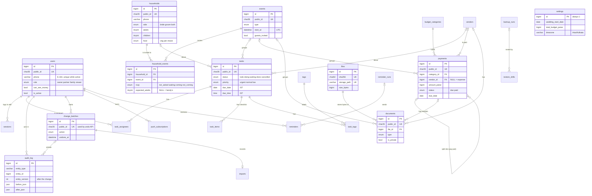

# DATABASE.md — Release 1 Database Design

Version 1.2 · 8 Oct 2026 · Owner: Ayush Porwal · v1.1 applies the owner's answers (§10) through migration `002_open_answers.sql` · v1.2 adds `003_api_support.sql` for API.md v1.1 (`rate_limits`, checklist-item keys)
Reads from: `CONTEXT.md` (source of truth), `FEATURES.md`, `DESIGN.md`, `API.md`, spec §9.
Files: `schema.sql` (= migration `001_init.sql`), `002_open_answers.sql`, `003_api_support.sql`, `seed_demo.sql` (DEV ONLY).
Database: **MySQL 8.0.16+** on Hostinger (answered). Every file also runs on MariaDB 10.4+.

## Conflicts flagged

| # | Topic | Sources say | This design does |
|---|---|---|---|
| DB1 | `wedding_id` and a `weddings` table | Brief: on every table. CONTEXT decision 1: no `weddings` table. | **Answered: follow CONTEXT.** No `wedding_id`. One-row `settings` table holds names, dates and timezone. |
| DB2 | IDs | Brief: `public_id` ULID. CONTEXT §8: `client_uuid` only. | **Both.** They do different jobs (see §3). CONTEXT §8 needs `public_id`, `deleted_by` and `delete_batch_id` added to the standard columns. |
| DB3 | Reminder tables | Brief: create now. FEATURES: reminders are R2a. | **Created now, left empty.** No R1 code writes to them. Saves a migration in November. |
| DB4 | Audit format | Brief: `before_json` / `after_json`. FEATURES A5: one `changes` diff. | **Full before/after rows**, plus `batch_id`, `entity_version`, `device`, `note`. PHP builds the "changed X from A to B" sentences from the two rows. |
| DB5 | Audit protection | FEATURES A5: a DB trigger blocks edits to `audit_log`. Brief: no triggers. | **No trigger.** PHP has no update/delete path for it. Nightly backups are the safety net. |
| DB6 | `users.last_seen_at` | FEATURES B1 lists it. | **Removed** after self-review (§9, R1). "Last seen" = newest `sessions.last_used_at`. |
| DB7 | Payments card window | Brief: due in 7 days. FEATURES B2: 14 days. | **14 days** (FEATURES B2), since no window was set. It is a query parameter, so changing it needs no migration. |
| DB9 | Food options | FEATURES A8/A9/B5 and the import template list Non-veg. | **Answered: only veg is served.** `nonveg` removed in `002`. **FEATURES v1.2 and the template spec now match** (answered). |
| DB10 | Mayra | FEATURES B4 seeds Mayra with side Both. | **Answered: one event, groom side.** Set in `002`. |
| DB11 | Rate-limit storage | API.md §10 needs counters beyond login. | **Answered: added `rate_limits` in `003`.** |
| DB8 | `delete_batches` | FEATURES B9 | Named **`change_batches`**. Same job, but it also groups bulk edits, imports, pay-part and undo. |

---

## 1. Release 1 entities

30 tables (29 from `001`, plus `rate_limits` from `003`). Grouped by job.

| Group | Table | Purpose | Editable?* |
|---|---|---|---|
| Ledger | `schema_migrations` | Which migration files have run | — |
| People | `users` | Members: phone login, role, money access | ✓ |
| | `sessions` | 90-day login cookies (hashed) and CSRF secret | — |
| | `login_attempts` | Rate limit: 5 per phone / 20 per IP in 15 min | — |
| | `password_resets` | Log of every reset or change (never the password) | — |
| | `idempotency_keys` | Stored reply for each write, so a retry returns the same answer | — |
| | `rate_limits` | Request counters per user / IP / window (API.md §10). Added in `003`. | — |
| Wedding | `settings` | One row: names, dates, city, total budget, timezone | ✓ |
| | `events` | The 7 functions plus custom dates | ✓ |
| Guests | `households` | A "Family": one invitation unit with headcount | ✓ |
| | `household_events` | Invitation of one family to one event, with RSVP | ✓ |
| Tasks | `tasks` | Every job, due date, status | ✓ |
| | `task_assignees` | Who does a task (many people) | child of task |
| | `task_items` | Checklist inside a task | ✓ |
| | `tags` | Shopping, Outfit, Jewelry… | ✓ |
| | `task_tags` | Tags on a task | child of task |
| Money | `budget_categories` | Planned amount per category | ✓ |
| | `vendors` | Light supplier contact | ✓ |
| | `payments` | Due or paid money. No vendor = "Expense" | ✓ |
| Files | `files` | Bytes on disk: path, MIME, size, SHA-256. Never changed | — |
| | `documents` | What a file is and what it links to | ✓ |
| History | `change_batches` | Groups a delete, bulk edit, import or undo, so it reverses as one | — |
| | `audit_log` | Every change: who, when, before, after | — |
| | `imports` | Past guest imports and their counts | ✓ |
| Safety | `backup_runs` | Each nightly backup (written by cron) | — |
| | `restore_drills` | Monthly restore test log | ✓ |
| | `exports` | Full-export jobs and 24-hour download links | — |
| R2a-ready | `push_subscriptions` | Web Push endpoints per phone | — |
| | `reminders` | Scheduled reminders, one per person per item | ✓ |
| | `reminder_runs` | Each 15-minute cron run (health check) | — |

\* **Editable** = has `version`, `created_*`, `updated_*`, `deleted_*`, `delete_batch_id` and (except `settings`) `client_uuid`. `settings` can't be deleted, so it has no `deleted_*`. Logs and system tables are append-only.

### Reference data in `001_init` (+ `002`)

| Table | Rows |
|---|---|
| `settings` | Mahi Jagetiya & Ayush Porwal, 14–16 Feb 2027, Bhilwara, Asia/Kolkata, INR |
| `events` | Engagement, Haldi, Mehndi, Sangeet, Mayra, Wedding, Reception. All "Date not set", guests invited. No separate Roka: Engagement covers it (answered). `002` sets Mayra to groom side. |
| `budget_categories` | The 14 from FEATURES B6, ₹0 planned. Miscellaneous is the fallback. |
| `tags` | Shopping, Outfit, Jewelry, Gifts, Decor, Food, Travel, Bride, Groom |

---

## 2. ER diagram

Standard columns (`version`, `created_*`, `updated_*`, `deleted_*`) and `*_by → users` links are left out to keep it readable. Every editable table has them.



---

## 3. Design choices

### Identity and keys

| Choice | Why |
|---|---|
| `id BIGINT UNSIGNED AUTO_INCREMENT` | Fast joins and small indexes. Never shown to users. |
| `public_id CHAR(26)` ULID on anything in a URL | Guest records can't be guessed by counting (`/households/42` → 43). ULIDs sort by creation time and are short. PHP generates them. |
| `client_uuid CHAR(36) UNIQUE` on editable tables | The phone makes it once per form. A retried create hits the unique key, and PHP returns the existing row. No duplicates on weak networks (CONTEXT decision 9). |
| `idempotency_keys` as well | `client_uuid` covers creates. This covers everything else — mark paid, pay part, bulk invite, import — by replaying the stored reply. Expires after 48 h. |
| IDs, hashes and phones stored as `ascii` | They only ever hold ASCII. Index entries are 4× smaller than utf8mb4. All human text stays utf8mb4. |
| `public_id` not on `household_events`, `task_items`, link tables, logs | They are only reached through a parent (`/households/{id}/invitations/{event}`). |

### Time and money

| Choice | Why |
|---|---|
| `DATETIME` in UTC for moments (`start_at`, `created_at`) | One rule everywhere. PHP converts to IST for display. `DATETIME` doesn't shift with the server's timezone the way `TIMESTAMP` does. |
| `DATE` / `TIME` with no zone for calendar things (`due_date`, `due_time`, `paid_on`) | "Due 10 Oct" means 10 Oct in India, wherever the phone is. Overdue maths uses "today in IST", passed in by PHP. |
| Every connection runs `SET time_zone = '+00:00'` | Column defaults (`CURRENT_TIMESTAMP`) then produce UTC. Without it, Hostinger's server zone would leak in. |
| Money is `BIGINT` paise, **signed**, with `CHECK (>= 0)` | No floats, no rounding. Signed so `planned − spent` can go negative in SQL ("Over by ₹x") without an "out of range" error, which unsigned maths throws. |
| Max payment ₹10 crore (`1000000000` paise) | FEATURES B6 rule, enforced in the DB too. |

### Data safety

| Choice | Why |
|---|---|
| `version INT` on every editable table | Every update is `… WHERE id = ? AND version = ?`. 0 rows changed = someone else saved first → 409 and the conflict screen. Tested: §8. |
| Soft delete: `deleted_at`, `deleted_by`, `delete_batch_id` | Nothing is hard-deleted in R1. `CHECK ((deleted_at IS NULL) = (delete_batch_id IS NULL))` means every deleted row belongs to a batch, so it can always be restored with its children. |
| `change_batches` | Trash rows, Undo and "Undo this import" all work on a batch. Restore touches only rows whose `delete_batch_id` matches, so an invitation removed last week does not come back when you restore its family today. |
| `audit_log.entity_version` | Undo reverts a row only if it is still at the version it reached in that batch. If Mummy edited it since, it is skipped and named (FEATURES A2). |
| All foreign keys `ON DELETE RESTRICT` | The app never hard-deletes, so cascades would never run in normal use. Their only effect would be to make a mistaken `DELETE` in phpMyAdmin wipe children silently. RESTRICT makes it fail loudly. Tested: §8. |
| Link tables (`household_events`, `task_assignees`, `task_tags`) are unique on the pair **including deleted rows** | Re-inviting a family or re-assigning a person **revives** the old row (`deleted_at = NULL`, version +1). One row per pair for ever, so history stays in one place and there is never a clash on restore. |
| User-named things (`tags`, `budget_categories`) are unique only while live | A generated column (`live_name`) is NULL once deleted. You can delete "Decor" and make a new "Decor". Restoring the old one then clashes and is blocked with a reason (FEATURES B9). |
| `files` are immutable; `sha256` is unique | A file is never overwritten. Uploading the same bytes twice reuses the file row, and a second `documents` row points to it ("Save again"). |
| `audit_log` stores full rows, not just diffs | Undo and "restore from history" need the whole old row. ~2,000 families × a few edits is small. Password hashes are never written into it. |

### Rules in the database (CHECK, ENUM, UNIQUE)

| Rule | How |
|---|---|
| Exactly one owner | Generated `owner_slot` = 1 for the owner, else NULL, with a UNIQUE key |
| Owner and partner always see money; owner always active | CHECKs on `users` |
| Phone unique among active members | Generated `active_phone` + UNIQUE. A deactivated member's phone can be reused. |
| One settings row | `CHECK (id = 1)` |
| Event ends after it starts; map link is `https://` | CHECKs on `events` |
| 0–50 adults and children, at least 1 person; Jain count ≤ people | CHECKs on `households` |
| Paid needs `paid_on` + method; Due has no `paid_on` | `ck_payments_state` |
| Done ⇔ `completed_at` set; `due_time` needs `due_date` | CHECKs on `tasks` |
| One fallback category, and it can't be deleted | Generated `fallback_slot` + CHECK |
| JPEG / PNG / WebP / PDF only, ≤ 10 MB | CHECKs on `files` |
| Notes ≤ 5,000 characters | CHECK on each `notes` |
| Yes/no flags | `TINYINT UNSIGNED` + `CHECK (x IN (0,1))`. Not `TINYINT(1)`: MySQL 8 warns that display widths are deprecated. |
| Statuses | `ENUM`, values exactly as FEATURES. ENUM order is the sort order (`urgent, normal, low`). |
| Food | `veg`, `jain`, `mixed` (after `002`). Mixed = a veg family with some Jain members. |

ENUM vs CHECK: ENUMs are compact and readable in phpMyAdmin. Adding a value **at the end** is an instant, non-breaking `ALTER` on both engines (tested in §6). Never reorder or remove a value.

PHP must also set `sql_mode` to strict on connect (§7). In non-strict mode a bad ENUM value is silently saved as `''`.

### Indexes

Every list filter in FEATURES has an index that starts with `deleted_at` (live rows only) and then the filter column.

| Screen / filter | Index |
|---|---|
| Tasks: Today, Overdue, This week, No date, Done | `tasks (deleted_at, status, due_date, priority)` |
| Tasks: My tasks / assignee | `task_assignees (user_id, deleted_at, task_id)` |
| Tasks: event, vendor, family, tag, priority | `tasks (event_id, …)`, `(vendor_id, …)`, `(household_id, …)`, `task_tags (tag_id, …)`, `tasks (deleted_at, priority)` |
| Guests: side, group, area, food, Important, sort by name | `households (deleted_at, side, name)`, `(deleted_at, group_name)`, `(deleted_at, area)`, `(deleted_at, food)`, `(deleted_at, is_vip)`, `(deleted_at, name)` |
| Guests: event + RSVP, headcount | `household_events (event_id, deleted_at, rsvp)` |
| Duplicate checks | `households (phone)`, `(alt_phone)`, `(name_norm, city)`; `vendors (phone)`; `files (sha256)` |
| Payments: Due/Overdue/Paid, month | `payments (deleted_at, status, due_date)`, `(deleted_at, paid_on)` |
| Payments: category, vendor, event | `payments (category_id, deleted_at, status)`, `(vendor_id, …)`, `(event_id, …)` |
| Documents: type, payment, vendor, event | `documents (deleted_at, type, created_at)` + one per link |
| Calendar agenda | `events (deleted_at, start_at)` + the task and payment due-date indexes |
| History / Activity / Trash | `audit_log (entity_type, entity_id, id)`, `(user_id, created_at)`, `(created_at)`, `(batch_id)`; `change_batches (action, created_at)` |
| Login, rate limit | `sessions (token_hash)`, `login_attempts (phone, attempted_at)`, `(ip, attempted_at)` |
| Reminder cron | `reminders (status, remind_at)`, `reminder_runs (started_at)` |

Search by name, phone digits, group or area uses `LIKE '%…%'`. At 2,000 families that is a few milliseconds; a FULLTEXT index would add risk for no gain.

---

## 4. Spec §9 entities → what we built

| Spec entity | Status | Where it lives |
|---|---|---|
| users | **R1** | `users` |
| weddings | Replaced | `settings` (one row) — CONTEXT decision 1 |
| wedding_members | Dropped | `users.role` |
| partners | Replaced | `settings` (bride/groom names, side labels) |
| events | **R1** | `events` |
| tasks | **R1** | `tasks` + `task_assignees` |
| task_subtasks | **R1** as checklist | `task_items` |
| guests | **R1** as families | `households` |
| guest_events | **R1** | `household_events` |
| rsvps | **R1**, merged | `household_events.rsvp` |
| invitations | **R1**, merged | `household_events` (card tracking columns in R2a) |
| vendors | **R1** (light) | `vendors` |
| budgets | **R1** | `budget_categories` + `settings.total_budget_paise` |
| expenses | **R1**, merged | `payments` with no vendor (FEATURES C7) |
| payments | **R1** | `payments` |
| documents | **R1** | `documents` + `files` |
| tags | **R1** | `tags` |
| entity_tags | **R1**, typed | `task_tags` (real foreign keys instead of a polymorphic table) |
| reminders | **Created, used R2a** | `reminders`, `reminder_runs`, `push_subscriptions` |
| notifications | Planned R2a | Covered by `reminders` (sent_at, sent_via). No extra table unless needed. |
| notes | Dropped | A `notes` column on each record |
| accommodations | Planned R2b | Columns on `households` (FEATURES C8) |
| vendor_events | Later | Payments, tasks and documents already link vendor + event |
| transport, transport_assignments | R3 candidate | `transport_pickups` only if > 20 pickups |
| shopping_items, outfits, jewelry_items | Cut | Tasks + tags + checklist (PRD §4.1) |
| venues | Cut | `events.venue_*` |
| photos, albums | Cut / Later | `documents` type `photo`; galleries stay external links |
| comments | Cut | Out of scope (CONTEXT §5) |

### Planned for Releases 2–3 (not created yet)

All are additive: new tables or new nullable columns. No R1 column changes meaning.

| Release | Change | Shape |
|---|---|---|
| R2a | Card tracking | `households`: `card_given_on DATE`, `card_given_by → users`, `einvite_opened_at DATETIME` |
| R2a | Reminders live | Start writing to the 3 tables created now. Append `'reminder_sent'` to `audit_log.action`. |
| R2a | Email fallback | `users.email` already exists (nullable); admins fill it in |
| R2b | `timeline_items` | `event_id`, `starts_at`, `title`, `lead_user_id` / `lead_vendor_id`, `status` (upcoming/now/done), `manual_override`, standard columns |
| R2b | `contacts` | Doctor, emergency and venue-manager numbers for the Call tab: `name`, `role`, `phone`, `event_id`, `sort_order`, standard columns |
| R2b | Rooms | `households`: `hotel_name`, `room_no`, `check_in_date`, `arrival_note` |
| R3 | `transport_pickups` | Only if > 20 pickups: `household_id`, `pickup_at`, `from_place`, `vehicle`, `driver_phone`, standard columns |
| R3 | Hindi UI | `users.ui_language ENUM('en','hi') DEFAULT 'en'` |
| Later | Purge | After 16 May 2027 only: a `purge_runs` log. Hard delete stays out of app code until then. |

---

## 5. How PHP must use this schema

The schema gives the guarantees. These rules make sure the code doesn't undo them.

| # | Rule |
|---|---|
| 1 | **On connect:** `SET NAMES utf8mb4`, `SET time_zone = '+00:00'`, `SET SESSION sql_mode = 'STRICT_ALL_TABLES,NO_ZERO_DATE,NO_ZERO_IN_DATE,ERROR_FOR_DIVISION_BY_ZERO'`. PDO in exception mode. |
| 2 | **Create:** insert with `client_uuid`. On a duplicate-key error for it, return the existing row with 200. |
| 3 | **Update:** write **only the columns the user changed**, plus `version = version + 1`, `updated_by`. `WHERE id = ? AND version = ? AND deleted_at IS NULL`. 0 rows → re-read: deleted → "deleted by Papa"; else 409 with the current row. |
| 4 | **Same transaction:** the change, its `audit_log` row and its `change_batches` row commit together, or not at all (AC-ACT-03). |
| 5 | **Delete:** create a `change_batches` row, then set `deleted_at`, `deleted_by`, `delete_batch_id`, `version + 1` on the row **and its children** in that batch: task → checklist + assignees + tags; family → invitations; event → invitations; payment → receipts. |
| 6 | **Restore:** clear `deleted_*` and `delete_batch_id` where `delete_batch_id = ?` and `deleted_at IS NOT NULL`. Version + 1. Audit `restore`. |
| 7 | **Undo:** for each audit row in the batch, revert to `before_json` only if the row's `version` still equals `entity_version`. Report the skipped ones. Mark the batch `undone_at` with `WHERE undone_at IS NULL` (a second tap does nothing). |
| 8 | **Child lists** (assignees, tags, checklist) are saved through the parent. Always bump the **parent's** version first, with the version check. |
| 9 | **Lock the parent** when inserting a child that a parent delete would hide: `SELECT … LOCK IN SHARE MODE` on the category, family, event, task or payment. The delete side uses `SELECT … FOR UPDATE`. (Fix R3, tested.) |
| 10 | **Bulk actions** send `as_of` (when the list was loaded). Rows with `updated_at >= as_of` are skipped and named. (Fix R4.) |
| 11 | **Bookkeeping writes** (`last_reminder_opened_at`, `sessions.last_used_at`) don't bump `version` and set `updated_at = updated_at` so they don't look like edits. (Fix R2.) |
| 12 | **Never `DELETE`** except expired rows in `sessions`, `login_attempts`, `idempotency_keys` and `rate_limits`. Export ZIPs are deleted from disk after 24 h; their rows stay. |
| 13 | **Uploads:** write the file to disk first, then insert `files` + `documents` in one transaction. On a duplicate `sha256`, check the stored file still exists with the same size; if not, rewrite the bytes to its path. |
| 14 | **Schema check:** PHP has `EXPECTED_SCHEMA_VERSION`. If `MAX(version)` in `schema_migrations` with `finished_at` set is lower, the API refuses writes with "The app is being updated." |

---

## 6. Migrations

### Files

```
/db/migrations/
  001_init.sql          ← schema.sql
  002_open_answers.sql  ← Mayra groom side, veg-only food, audit tamper check
  003_api_support.sql   ← rate_limits table, checklist-item keys (API.md v1.1)
  004_r2a_card_tracking.sql   (R2a, example below)
  005_…
/db/dev/
  seed_demo.sql         ← DEV ONLY. Not a migration. Never on the live DB.
```

### Rules

| # | Rule |
|---|---|
| 1 | Numbered `NNN_short_name.sql`, run in order, each once. |
| 2 | **Never edit a file that has been applied.** To fix it, write the next number. |
| 3 | The first statement after the `SET` lines inserts the `schema_migrations` row. A second run stops right there with "Duplicate entry". That is the guard. |
| 4 | The last statement sets `finished_at`. A row with `finished_at` NULL means the file stopped part-way. |
| 5 | Only additive changes during the wedding: new tables, new **nullable or defaulted** columns, new indexes, ENUM values **appended at the end**. Never rename, drop or retype a column the live app reads. If one must go: stop using it in code first (one release), drop it in a later migration. |
| 6 | No triggers, procedures or events. |
| 7 | Keep each file small. MySQL/MariaDB can't roll back `CREATE`/`ALTER`, so a failure leaves earlier statements applied. |

### Running one in phpMyAdmin

1. **Export** the database (Export → Quick → SQL). Keep the file until the next nightly backup is green.
2. **Staging first:** import the export into a second database (Business plan allows several), run the migration there, open the app against it.
3. On live: select the database → **Import** → choose the file → Character set **utf-8** → leave **Enable foreign key checks** ticked → **Go**.
4. Check: `SELECT * FROM schema_migrations ORDER BY version DESC LIMIT 3;` — the new row has `finished_at` set.
5. Deploy the PHP that expects the new version (rule 14 above).
6. **If it failed part-way:** read the error, then either finish the remaining statements by hand and set `finished_at`, or restore the export from step 1. Never re-run the whole file, unless its header gives recovery steps (as `002` does).

### `002_open_answers.sql` (previous delivery)

| Step | Change | If it stops |
|---|---|---|
| A | `households.food` → `veg`, `jain`, `mixed` | Runs first. If any family is Non-veg it stops here with nothing else changed. Fix those families in the app, delete the unfinished `schema_migrations` row for version 2, and run the file again (steps are in its header). Tested. |
| B | Mayra `side` → `groom`, with an `audit_log` row ("Migration 002") and version + 1 | — |
| C | `backup_runs.audit_row_count`, `audit_max_id` | — |

### `003_api_support.sql` (this delivery)

| Step | Change | If it stops |
|---|---|---|
| 1 | New table `rate_limits (bucket, window_start, hits)`, PK on the pair, index on `window_start` | Nothing else has changed. Finish by hand or restore the export. |
| 2 | `task_items.client_uuid = UUID()` where NULL, keeping `updated_at` (rule 11). The API addresses checklist items by this key. | Re-run only this `UPDATE`, then the last line. |

Order to run: `001_init.sql` → `002_open_answers.sql` → `003_api_support.sql` → (dev only) `seed_demo.sql`. The seed doesn't touch `rate_limits` and gives every checklist item a key, so it can run before or after `003`.

### Example: `004_r2a_card_tracking.sql` (R2a; tested on both engines)

```sql
SET NAMES utf8mb4 COLLATE utf8mb4_unicode_ci;
SET time_zone = '+00:00';
INSERT INTO schema_migrations (version, name, applied_by) VALUES (4, '004_r2a_card_tracking', 'phpMyAdmin');

ALTER TABLE households
  ADD COLUMN card_given_on     DATE NULL AFTER notes,
  ADD COLUMN card_given_by     BIGINT UNSIGNED NULL AFTER card_given_on,
  ADD COLUMN einvite_opened_at DATETIME NULL AFTER card_given_by,
  ADD KEY ix_households_live_card (deleted_at, card_given_on),
  ADD CONSTRAINT fk_households_card_by FOREIGN KEY (card_given_by)
      REFERENCES users (id) ON DELETE RESTRICT ON UPDATE RESTRICT;

ALTER TABLE audit_log
  MODIFY action ENUM('create','update','delete','restore','undo','import','export',
                     'login','login_failed','logout','password_reset','role_change',
                     'merge','whatsapp_opened','backup','restore_drill',
                     'reminder_sent') NOT NULL;   -- appended at the end only

UPDATE schema_migrations SET finished_at = CURRENT_TIMESTAMP WHERE version = 4;
```

All R1 dashboard queries ran unchanged after it (tested when it was numbered `003`; only the number changed).

### Demo data

`seed_demo.sql` (run after `002`) adds 8 members (password `demo-1234`), 60 families (Devanagari names, emoji notes, a shared-phone pair, one deleted family), 182 invitations, 11 vendors, 21 payments (overdue, due today, due this week, a pay-part pair, one deleted), 21 tasks (overdue, today, done, cancelled, one deleted with its checklist), 6 documents, 7 backup runs (one failed), a restore drill and sessions. "Today" in the data is Thu 8 Oct 2026. Its first insert is user id 1, so on a database that already has an owner it stops at once.

---

## 7. Dashboard queries

PHP passes "now" in IST, because "today" and "overdue" are IST ideas:

```sql
SET @today = '2026-10-08';     -- today's date in IST
SET @now_time = '14:00:00';    -- current IST time
SET @me = 3;                   -- logged-in user id
```

In PHP these are bound parameters, not session variables. Every query filters `deleted_at IS NULL` (AC-TRS-07). Results below are from the demo data.

### 7.1 My tasks due today

```sql
SELECT t.public_id, t.title, t.status, t.priority, t.due_time
FROM tasks t
JOIN task_assignees ta
  ON ta.task_id = t.id AND ta.deleted_at IS NULL AND ta.user_id = @me
WHERE t.deleted_at IS NULL
  AND t.status IN ('todo','doing','waiting')
  AND t.due_date = @today
  AND NOT (t.due_time IS NOT NULL AND t.due_time < @now_time)   -- those are overdue
ORDER BY t.due_time IS NULL, t.due_time, t.priority, t.created_at DESC
LIMIT 5;
```

Demo: 1 row — "Call Mama ji about Mayra arrangements, 6:00 PM".

### 7.2 Overdue tasks (everyone)

```sql
SELECT t.public_id, t.title, t.status, t.priority, t.due_date, t.due_time,
       DATEDIFF(@today, t.due_date) AS days_late
FROM tasks t
WHERE t.deleted_at IS NULL
  AND t.status IN ('todo','doing','waiting')
  AND (t.due_date < @today
       OR (t.due_date = @today AND t.due_time IS NOT NULL AND t.due_time < @now_time))
ORDER BY t.due_date, t.priority, t.created_at DESC;
```

Demo: 4 rows, including "Collect shagun envelopes" (due today 11:00 AM, now past). Uses `ix_tasks_live_status_due`.

### 7.3 Payments due in the next 14 days (money users only)

```sql
SELECT p.public_id, p.title,
       COALESCE(v.name, 'Expense') AS paid_to,
       v.deleted_at IS NOT NULL    AS vendor_deleted,
       p.amount_paise, p.due_date,
       p.due_date < @today         AS is_overdue
FROM payments p
LEFT JOIN vendors v ON v.id = p.vendor_id
WHERE p.deleted_at IS NULL
  AND p.status = 'due'
  AND p.due_date <= DATE_ADD(@today, INTERVAL 14 DAY)  -- includes overdue
ORDER BY p.due_date, p.amount_paise DESC;
```

Demo: 5 payments, ₹5,20,000 in total, one overdue (tent, 6 Oct). Due payments with no date are a separate "No date" chip.

### 7.4 RSVP counts per event

```sql
SELECT e.public_id, e.name, e.start_at,
  COUNT(he.id) AS families_invited,
  COALESCE(SUM(he.rsvp = 'coming'), 0) AS families_coming,
  COALESCE(SUM(CASE WHEN he.rsvp = 'coming'
      THEN COALESCE(he.expected_adults, h.adults) + COALESCE(he.expected_children, h.children) END), 0) AS people_coming,
  COALESCE(SUM(CASE WHEN he.rsvp = 'waiting'
      THEN COALESCE(he.expected_adults, h.adults) + COALESCE(he.expected_children, h.children) END), 0) AS people_waiting,
  COALESCE(SUM(CASE WHEN he.rsvp = 'not_asked'
      THEN COALESCE(he.expected_adults, h.adults) + COALESCE(he.expected_children, h.children) END), 0) AS people_not_asked,
  COALESCE(SUM(he.rsvp = 'not_coming'), 0) AS families_not_coming,
  COALESCE(SUM(CASE WHEN he.rsvp = 'coming' THEN
      CASE h.food
        WHEN 'jain'  THEN COALESCE(he.expected_adults, h.adults) + COALESCE(he.expected_children, h.children)
        WHEN 'mixed' THEN LEAST(h.jain_count, COALESCE(he.expected_adults, h.adults) + COALESCE(he.expected_children, h.children))
        ELSE 0 END END), 0) AS jain_coming
FROM events e
LEFT JOIN (household_events he
           JOIN households h ON h.id = he.household_id AND h.deleted_at IS NULL)
       ON he.event_id = e.id AND he.deleted_at IS NULL
WHERE e.deleted_at IS NULL AND e.guests_invited = 1
GROUP BY e.id, e.public_id, e.name, e.start_at, e.sort_order
ORDER BY e.start_at IS NULL, e.start_at, e.sort_order;
```

"Up to" = `people_coming + people_waiting`. A family's own adults/children are used unless the invitation overrides them (FEATURES B5), so editing a family updates every event at once with no extra writes. The deleted family's invitations are not counted (Wedding shows 60 families, not 61).

### 7.5 Budget by category

```sql
SELECT c.public_id,
       CONCAT(c.name, IF(c.deleted_at IS NULL, '', ' (deleted)')) AS name,
       c.planned_paise,
       COALESCE(SUM(CASE WHEN p.status = 'paid' THEN p.amount_paise END), 0) AS spent_paise,
       COALESCE(SUM(CASE WHEN p.status = 'due'  THEN p.amount_paise END), 0) AS due_paise,
       c.planned_paise
         - COALESCE(SUM(CASE WHEN p.status = 'paid' THEN p.amount_paise END), 0) AS left_paise,
       (c.planned_paise > 0
         AND COALESCE(SUM(p.amount_paise), 0) > c.planned_paise) AS is_over
FROM budget_categories c
LEFT JOIN payments p ON p.category_id = c.id AND p.deleted_at IS NULL
WHERE c.deleted_at IS NULL
   OR p.id IS NOT NULL            -- never hide live money in a deleted category (fix R3)
GROUP BY c.id, c.public_id, c.name, c.deleted_at, c.planned_paise, c.sort_order
ORDER BY c.sort_order;
```

Totals card:

```sql
SELECT COALESCE(s.total_budget_paise,
         (SELECT SUM(planned_paise) FROM budget_categories WHERE deleted_at IS NULL)) AS planned_paise,
       COALESCE(SUM(CASE WHEN p.status = 'paid' THEN p.amount_paise END), 0) AS spent_paise,
       COALESCE(SUM(CASE WHEN p.status = 'due'  THEN p.amount_paise END), 0) AS still_to_pay_paise
FROM settings s
LEFT JOIN payments p ON p.deleted_at IS NULL
WHERE s.id = 1
GROUP BY s.total_budget_paise;
```

Demo: Planned ₹40,00,000 · Spent ₹7,95,350 · Still to pay ₹16,80,000. Clothing shows Over (₹1,02,500 against ₹1,00,000).

### 7.6 Health checks (Safety card)

```sql
-- Last good backup (red if > 26 h)
SELECT MAX(finished_at) AS last_ok FROM backup_runs WHERE status = 'ok';
-- Last reminder run (R2a; red if > 30 min)
SELECT MAX(started_at) AS last_run FROM reminder_runs;
-- Last restore drill (amber if > 35 days)
SELECT MAX(done_on) FROM restore_drills WHERE deleted_at IS NULL AND result = 'passed';
-- Audit tamper check (after 002): red if count or max id went DOWN since the previous good backup
SELECT b.finished_at, b.audit_row_count, b.audit_max_id,
       (b.audit_row_count < prev.audit_row_count OR b.audit_max_id < prev.audit_max_id) AS audit_rows_lost
FROM backup_runs b
JOIN backup_runs prev ON prev.id = (SELECT MAX(id) FROM backup_runs
                                    WHERE status = 'ok' AND id < b.id AND audit_row_count IS NOT NULL)
WHERE b.id = (SELECT MAX(id) FROM backup_runs WHERE status = 'ok' AND audit_row_count IS NOT NULL);
-- Migration finished?
SELECT version, name, finished_at FROM schema_migrations ORDER BY version DESC LIMIT 1;
```

---

## 8. What was tested

Sandbox, 8 Oct 2026, on **MySQL 8.0.46** (your Hostinger engine) and **MariaDB 10.11.14** (fallback).

| Test | Result (both engines) |
|---|---|
| `schema.sql` on an empty utf8mb4 database | Runs with no errors or warnings. 29 tables. |
| Running `schema.sql` a second time | Stops at the first statement. Nothing changed. |
| `seed_demo.sql` after it | Runs clean. A second run stops at user id 1. |
| Devanagari and 4-byte emoji (🙏🏽, 👨‍👩‍👧, ✈️) | Stored and read back intact |
| 34 bad writes (second owner, duplicate active phone, partner without money, payment ₹0 or > ₹10 crore, Paid without date, Done without `completed_at`, adults 51, Jain count > people, bad ENUM, `http://` map link, end before start, deleting the fallback category, `.exe` upload, 20 MB file, invalid JSON, hard `DELETE` of a family/user/event, …) | **All 34 refused**, each by the intended constraint |
| Allowed edge cases (reuse a deactivated member's phone; re-create a deleted tag's name) | Allowed |
| All dashboard queries | Same results on both engines; `EXPLAIN` shows index use |
| Stale-version update | 0 rows changed → 409 path works |
| Category delete racing a new payment | Reproduced the hidden-money bug without locks; fixed with rule 9 (see R3) |
| `002_open_answers` after `001` | No errors or warnings. Mayra = groom with an audit row. Second run stops at the guard. |
| `002` with a Non-veg family already saved | Stops at step A; Mayra untouched; recovery steps work |
| `003_api_support` after `002` (8 Oct, MySQL 8.0.46 and MariaDB 10.11.14) | No errors or warnings. 30 tables. Checklist items without a key got a UUID; `updated_at` and `version` unchanged. Second run stops at the guard. `rate_limits` upsert counts correctly. |
| Card-tracking example (now `004`) | Applied; guard works; R1 queries unchanged |

---

## 9. Self-review: where a concurrent edit or a delete could lose data

| # | Table | Risk found | Fix | Status |
|---|---|---|---|---|
| R1 | `users` | `last_seen_at` written on every request would bump `updated_at` and race with an admin changing role or money access. | Column **removed**. "Last seen" = `MAX(sessions.last_used_at)` (new index `sessions (user_id, last_used_at)`). | Fixed in schema |
| R2 | `household_events` | A WhatsApp tap writes `last_reminder_opened_at`. If PHP saved a whole row on RSVP edit, it could overwrite that, or the reverse. | Rule 3: write only changed columns. Rule 11: bookkeeping writes keep `updated_at` and `version` unchanged. | Fixed (PHP rule) |
| R3 | `budget_categories` → `payments` | Admin moves payments and deletes a category while Mahi saves a new payment into it. The payment lands in a deleted category and **vanishes from the budget screen**. Reproduced in the sandbox. | Rule 9: lock the category (`LOCK IN SHARE MODE` on insert, `FOR UPDATE` on delete). Re-run: Mahi gets "category deleted, pick another". Plus §7.5 now shows any live money in a deleted category, labelled "(deleted)". | Fixed and re-tested |
| R4 | `household_events`, `households` (bulk) | "Select all 260 → Set RSVP Coming" could overwrite an RSVP Mummy changed after the list was loaded. Audit keeps it, but her intent is lost silently. | Rule 10: bulk requests carry `as_of`; rows changed since are skipped and named. | Fixed (PHP rule) |
| R5 | `task_assignees`, `task_tags`, `task_items` | Two people edit a task's assignees; neither row has its own version. | Rule 8: child saves bump the task's version with the check, so the second save gets 409. Checklist items also have their own `version` for single ticks. | By design |
| R6 | `budget_categories` | Two fallback categories, or the fallback deleted, would leave new payments nowhere to go. | Generated `fallback_slot` UNIQUE + CHECK it can't be deleted. | Fixed in schema |
| R7 | `files` | Same bytes uploaded again reuse the old row. If that file was lost from disk, the new upload would point at nothing. | Rule 13: on a duplicate hash, check the stored file and rewrite it if missing. | Fixed (PHP rule) |
| R8 | `reminders` | Two overlapping cron runs could send the same reminder twice. | Claim with `UPDATE … SET status = 'sending', claimed_run_id = ? WHERE status = 'pending' AND remind_at <= now`; `dedupe_key` UNIQUE stops duplicate scheduling; CHECK needs a run id while sending. Stuck `sending` rows from a dead run are re-claimed after 10 min. | By design |
| R9 | Any child of a family/event/payment | Restoring a parent could bring back children that were removed earlier on purpose. | Restore only by `delete_batch_id`. Earlier removals are in other batches. | By design |
| R10 | Any table, Undo | Undo could wipe an edit made after the action. | Undo checks `entity_version`; changed rows are skipped and named. | By design |
| R11 | `audit_log` | Nothing in the DB stops a manual `DELETE` (no triggers allowed). | PHP has no path. Nightly backups keep 7+ copies. **Added in `002`:** each backup records the audit row count and highest id; the Safety card goes red if either ever drops, so a deletion is caught within a day and the backup before it has the rows. | Detected + recoverable |
| R12 | `settings`, all editable tables | Lost update on a single record | `version` check on every update; verified in sandbox | By design |
| R13 | Every table | `phpMyAdmin` mistake: `DELETE FROM households WHERE …` | `ON DELETE RESTRICT` blocks it while invitations exist. Rows with no children could still be deleted — restore from the nightly backup. | Mitigated |

No table remains where a normal app action can lose data, as long as PHP follows §5.

---

## 10. Open Questions

**Answered 8 Oct 2026:**

| # | Question | Answer | Applied |
|---|---|---|---|
| 1 | Roka? | Engagement is happening; no separate Roka | Seed unchanged |
| 2 | Mayra | One event, groom side only | `002` step B |
| 3 | Payments card window | Not set → I chose 14 days (FEATURES B2) | §7.3 |
| 4 | Audit protection | My choice → nightly row-count / max-id check | `002` step C, §7.6 |
| 5 | Database | MySQL 8.0.16+ | Tested on 8.0.46 |
| 6 | Emails for reminders | Later | `users.email` stays nullable |
| 7 | Food | Only veg | `002` step A |
| 8 | CONTEXT.md §8 | Yes | CONTEXT.md v1.2 |
| 9 | FEATURES.md and the template: remove Non-veg, Mayra groom side | Yes | FEATURES v1.2 |
| 10 | Migration for API rate limits | Yes, write it | `003_api_support.sql` |

**Still open:**

1. **Payments window:** you wrote "No set". I read that as "no preference" and used 14 days. If you meant "show every due payment, however far off", say so; it's a one-word change in the query.
2. **Have you already run `001_init.sql` anywhere** (staging or live)? It doesn't change what you do (run `002` next either way), but it tells me whether `001` is now frozen.
